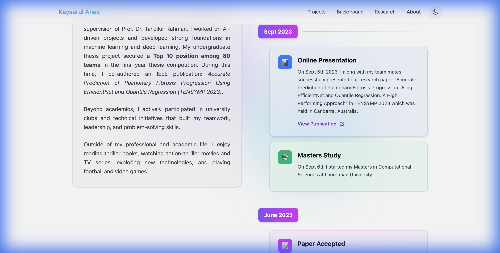

# Kaysarul Anas | Personal Portfolio

A modern, responsive **personal portfolio website** built with **React**, **Vite**, and **Tailwind CSS v4**. Designed to be fast, clean, and professional, the site showcases projects, skills, and experience with a strong focus on UI/UX and responsiveness.

🔗 **Live Repository**: [https://github.com/Anaskaysar/portfolio](https://github.com/Anaskaysar/portfolio)

---

## 🚀 Tech Stack

* **Frontend**: React 19 (Vite)
* **Styling**: Tailwind CSS v4
* **Routing**: React Router DOM v7
* **State & Theme**: Context API (Dark / Light Mode)
* **Icons**: Custom SVG Components
* **Deployment**: Vercel / Netlify

---

## ✨ Highlights

* ⚡ **Fast & Lightweight** — Powered by Vite for instant reloads
* 🌗 **Dark / Light Mode** — Auto-detects system preference with manual toggle
* 📱 **Fully Responsive** — Optimized for mobile, tablet, and desktop
* 🧩 **Reusable Components** — Clean, modular React architecture
* 🗂️ **Centralized Data** — Easy content updates via `src/lib/data.js`
* 🎨 **Modern UI** — Minimal, developer-focused design

---

## 📂 Project Structure

```bash
portfolio-project/
├── frontend/           # React Frontend Application
│   ├── public/         # Static assets (favicons, images)
│   ├── src/
│   │   ├── components/ # Reusable UI components (Hero, Projects, etc.)
│   │   ├── lib/        # Centralized data and utility functions
│   │   ├── pages/      # Page components (Home, Projects, About, etc.)
│   │   ├── App.jsx     # Main App component with routing
│   │   └── main.jsx    # Application entry point
│   └── index.html      # HTML entry point
├── backend/            # (Planned) Django Backend
└── docs/               # Project documentation & screenshots
```

---

## 🛠️ Getting Started

### Prerequisites

* Node.js (v18+ recommended)
* npm or yarn

### Installation

1. Clone the repository:

```bash
git clone https://github.com/Anaskaysar/portfolio.git
cd portfolio
```

2. Navigate to the frontend directory:

```bash
cd frontend
```

3. Install dependencies:

```bash
npm install
```

4. Start the development server:

```bash
npm run dev
```

5. Open the app in your browser:

```text
http://localhost:5173
```

---

## 🖼️ Visual Evidence

### Desktop View


### Mobile View (400px)



---

## 🔜 Future Roadmap

* [ ] **Backend Integration** — Django + PostgreSQL for dynamic content management
* [ ] **Admin Dashboard** — Secure admin panel to manage projects and content
* [ ] **Blog Section** — Technical blogs and tutorials
* [ ] **SEO Optimization** — Meta tags, Open Graph, and performance tuning
* [ ] **Animations** — Subtle motion using Framer Motion

---

## 🤝 Contributing

This project is currently public while backend and dynamic data features are under development. Suggestions and feedback are welcome.

---

## 📄 License

This project is open source and available under the [MIT License](LICENSE).
