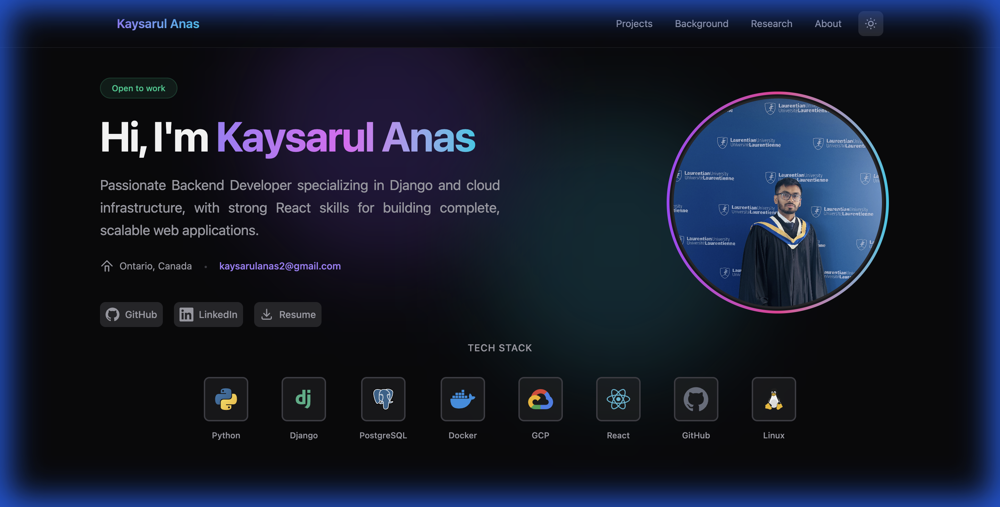

# Kaysarul Anas | Personal Portfolio

A modern, responsive **personal portfolio website** built with **React**, **Vite**, and **Tailwind CSS v4**. Designed to be fast, clean, and professional, the site showcases projects, skills, and experience with a strong focus on UI/UX and responsiveness.

🔗 **Live Repository**: [https://github.com/Anaskaysar/portfolio](https://github.com/Anaskaysar/portfolio)


./run.sh

---

## 🚀 Tech Stack

* **Frontend**: React 19 (Vite)
* **Backend**: Django 5.1 (Google Cloud Run)
* **Database**: PostgreSQL (Cloud SQL)
* **Storage**: Google Cloud Storage (GCS)
* **Styling**: Tailwind CSS v4
* **CI/CD**: GitHub Actions (GCP & Vercel)

---

## ✨ Highlights

* ⚡ **Fast & Lightweight** — Powered by Vite for instant reloads
* 🌗 **Dark / Light Mode** — Auto-detects system preference with manual toggle
* ☁️ **Cloud Integrated** — Permanent image storage via Google Cloud Storage
* 🤖 **Automated CI/CD** — Zero-touch deployments to Cloud Run and Vercel
* 📱 **Fully Responsive** — Optimized for mobile, tablet, and desktop
* 🎨 **Modern UI** — Minimal, developer-focused design

---

## 📂 Project Structure

```bash
portfolio-project/
├── frontend/           # React Frontend Application
├── backend/            # Django Backend Application
├── .github/workflows/  # CI/CD Pipeline configurations
└── docs/               # Project documentation & screenshots
```

---

## 📖 Documentation

Detailed guides for setting up and maintaining the project:

- [**Backend Setup Guide**](backend/setup_guide.md) — How to initialize and deploy the Django backend.
- [**CI/CD Documentation**](docs/CI_CD.md) — Detailed overview of the automated deployment pipelines.
- [**Troubleshooting Guide**](backend/troubleshooting.md) — Common errors and their solutions.

---

## 🛠️ Getting Started

### Prerequisites

* Node.js (v18+) & npm
* Python 3.12+ (for backend)
* Google Cloud SDK (for deployment)

### Installation

1. Clone the repository:
```bash
git clone https://github.com/Anaskaysar/portfolio.git
cd portfolio
```

2. Follow the [**Backend Setup Guide**](backend/setup_guide.md) to initialize the server.
3. Follow the [**Frontend README**](frontend/README.md) to start the UI.

---

## 🖼️ Visual Evidence

### Desktop View



---

## ✅ Progress & Roadmap

* [x] **Backend Integration** — Django + PostgreSQL for dynamic content management
* [x] **Cloud Storage** — Google Cloud Storage for permanent project images
* [x] **Automated CI/CD** — GitHub Actions for seamless deployments
* [ ] **Admin Dashboard** — Secure custom admin panel (Currently using enhanced Django Admin)
* [ ] **Blog Section** — Technical blogs and tutorials
* [ ] **SEO Optimization** — Meta tags, Open Graph, and performance tuning

---

## 🤝 Contributing

This project is currently public while backend and dynamic data features are under development. Suggestions and feedback are welcome.

---

## 📄 License

This project is open source and available under the [MIT License](LICENSE).
